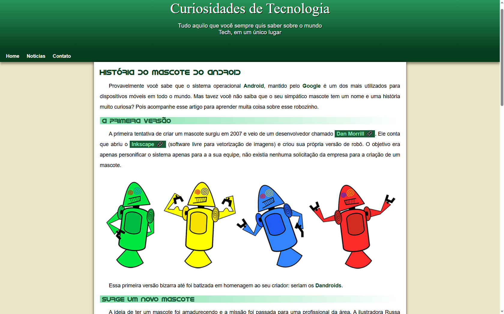

<h1> Projeto Android </h1>
 

<h2> Este foi o projeto que aprendi no curso de HTML5 e CSS3 do Curso em Vídeo </h2>

 Este repositório contém informações sobre a história do mascote do Android, suas curiosidades e evolução ao longo dos anos. 

<h2> Introdução </h2>
O projeto explora a origem do mascote do Android, conhecido como Bugdroid, e fornece detalhes sobre o desenvolvimento do sistema operacional Android, incluindo a nomeação das suas versões.

## Tecnologias utilizadas
* HTML
* CSS

## Ferramentas
* Git
* GitHub
* Visual Studio Code
* Navegador Web

## Rodando o projeto

<a href="https://daniel-pantoja.github.io/projeto-android/">Acesse aqui</a>

## Status do projeto
:heavy_check_mark: Aplicação finalizada.

